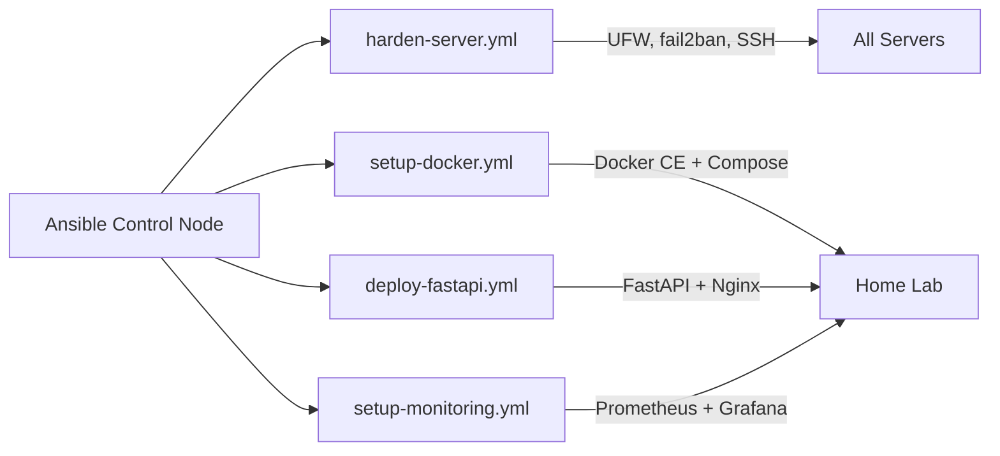

# 🤖 Ansible Playbooks — Hybrid Lab Automation

Ansible playbooks for automating server setup, app deployment, monitoring, and security hardening across Home Lab and Company Lab environments.


## 📈 Results

| Metric | Value |
|--------|-------|
| Playbooks | **4** (Docker, FastAPI, Monitoring, Hardening) |
| Server setup time | Manual ~2 hrs → **<15 min** (one playbook) |
| Environments covered | Home Lab + Company Lab |
| Security hardening | UFW + fail2ban + SSH lockdown in **one run** |
| Monitoring stack | Prometheus + Grafana + Node Exporter deployed automatically |
| Reproducibility | Idempotent — run multiple times safely |

---
## 📁 Project Structure

```
ansible-playbooks/
├── ansible.cfg                          # Ansible configuration
├── inventory/
│   └── hosts.example                    # Inventory template (fill your IPs)
├── playbooks/
│   ├── setup-docker.yml                 # Install Docker + Compose
│   ├── deploy-fastapi.yml               # Deploy FastAPI app
│   ├── setup-monitoring.yml             # Prometheus + Grafana + Node Exporter
│   ├── harden-server.yml                # UFW + fail2ban + SSH hardening
│   └── templates/
│       ├── docker-compose.yml.j2        # App compose template
│       ├── nginx.conf.j2               # Nginx reverse proxy
│       ├── monitoring-compose.yml.j2    # Monitoring stack compose
│       └── prometheus.yml.j2            # Prometheus scrape config
└── .gitignore
```

## 🚀 Quick Start

```bash
# 1. Clone
git clone https://github.com/DerbSwag/ansible-playbooks.git
cd ansible-playbooks

# 2. Configure inventory
cp inventory/hosts.example inventory/hosts
# Edit inventory/hosts with your server IPs

# 3. Test connection
ansible all -m ping

# 4. Run playbooks
ansible-playbook playbooks/setup-docker.yml
ansible-playbook playbooks/deploy-fastapi.yml
ansible-playbook playbooks/setup-monitoring.yml
ansible-playbook playbooks/harden-server.yml
```

## 📋 Playbooks

| Playbook | What it does |
|----------|-------------|
| **setup-docker.yml** | Install Docker CE + Compose plugin, add user to docker group |
| **deploy-fastapi.yml** | Deploy FastAPI + Nginx via Docker Compose, health check |
| **setup-monitoring.yml** | Deploy Prometheus + Grafana + Node Exporter |
| **harden-server.yml** | UFW firewall, fail2ban, disable root SSH, disable password auth |

## 🔄 Recommended Order

```
1. harden-server.yml    → Secure the server first
2. setup-docker.yml     → Install Docker
3. deploy-fastapi.yml   → Deploy application
4. setup-monitoring.yml → Add monitoring
```

## 🏗️ Target Architecture

```
Ansible Control Node (your machine)
    │
    ├── ansible-playbook setup-docker.yml ──► Home Lab (Docker installed)
    ├── ansible-playbook deploy-fastapi.yml ──► Home Lab (App running)
    ├── ansible-playbook setup-monitoring.yml ──► Home Lab (Monitoring up)




    └── ansible-playbook harden-server.yml ──► All servers (Secured)
```

## 🔒 Security

- No credentials in code — use `inventory/hosts` (gitignored)
- SSH key-based authentication only
- Playbooks disable password auth and root login

## 🗺️ Roadmap

- [ ] Add Ansible Vault for secrets
- [ ] Add role-based structure (roles/)
- [ ] Add k3s cluster setup playbook
- [ ] Add backup automation playbook
- [ ] Add Terraform + Ansible integration
- [ ] Add CI: lint playbooks with ansible-lint

## 📝 Part of DevOps Learning Path

See also:
- [DevOps FastAPI Lab](https://github.com/DerbSwag/Devops-fastapi-lab) — K8s + GitOps + Monitoring
- [AWS Terraform Lab](https://github.com/DerbSwag/aws-terraform-lab) — IaC on AWS
- [IT Automation Toolkit](https://github.com/DerbSwag/IT-Automation-Toolkit) — GLPI + PowerShell

## 📄 License

MIT
